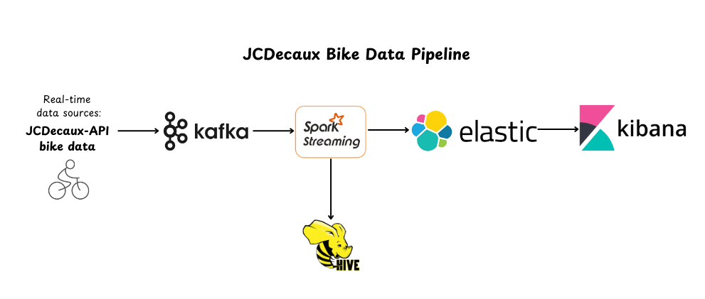

# 🚴‍♂️ _JCDecaux Bike Data Pipeline_

Welcome to the **JCDecaux Bike Data Pipeline** project! 

### 📊 Overview
This pipeline fetches real-time bike station data from JCDecaux's public API and processes it through a series of stages, including Kafka for messaging, Spark Streaming for processing, Elasticsearch for storage, and Kibana for data visualization.

[](docs/video-demonstration.mp4)
### 🛠 Architecture


The architecture of the pipeline consists of the following components:
1. **JCDecaux API**: Provides real-time bike station data.
2. **Kafka**: A distributed messaging system used to collect and distribute the data.
3. **Spark Streaming**: Processes data in real-time.
4. **Elasticsearch**: Stores processed data for easy retrieval and analysis.
5. **Kibana**: Visualizes the data stored in Elasticsearch.
###  🧰 Prerequisites
In this section, we walk you through a step-by-step guide. We will cover everything from installation to basic configuration.

**So Let's start!**

This is the version of each component. If you want to work with a different version, make sure to verify its compatibility with all the components in the pipeline.
 * _Java 11_
```bash
  sudo update-alternatives --config java
  sudo update-alternatives --config javac
  sudo update-alternatives --config jar
  export JAVA_HOME=/usr/lib/jvm/java-11-openjdk-amd64
  export PATH=$HOME/bin:$JAVA_HOME/bin
  ```
* _Kafka_ 3.6.0
* _Spark_ 3.2.4
* _Elasticsearch_ 8.8.2
* _Kibana_ 8.8.2

### ⚙️ Installation:
1. Kafka:
Download and install Kafka 3.6.0:
```bash
tar -xzf kafka_2.13-3.6.0.tgz
cd kafka_2.13-3.6.0
# Start Zookeeper
bin/zookeeper-server-start.sh config/zookeeper.properties
# Start Kafka broker
bin/kafka-server-start.sh config/server.properties
# Create a topic
bin/kafka-topics.sh --create --topic velib_stations --bootstrap-server localhost:9092
```
2. Spark
Install Spark and configure it for Kafka and Elasticsearch:

```bash
# Install Spark 3.2.4
wget https://example.com/spark-3.2.4.tgz
tar -xzf spark-3.2.4.tgz
cd spark-3.2.4

# Submit job with necessary packages
spark-submit --packages org.apache.spark:spark-sql-kafka-0-10_2.12:3.5.0,org.elasticsearch:elasticsearch-spark-30_2.12:8.8.2

```
3. Elasticsearch:

 Step 1: Install Elasticsearch, visit the official Elasticsearch website (https://www.elastic.co/downloads/elasticsearch) 
```bash
wget https://artifacts.elastic.co/downloads/elasticsearch/elasticsearch-8.8.2-linux-x86_64.tar.gz
wget https://artifacts.elastic.co/downloads/elasticsearch/elasticsearch-8.8.2-linux-x86_64.tar.gz.sha512
```
 Step 2: Extract the tar.gz file:
 ```bash
shasum -a 512 -c elasticsearch-8.8.2-linux-x86_64.tar.gz.sha512 
tar -xzf elasticsearch-8.8.2-linux-x86_64.tar.gz
cd elasticsearch-8.8.2/
 ```
 Step 3: Run Elasticsearch as a service:
```bash
sudo systemctl daemon-reload
sudo systemctl start elasticsearch
sudo systemctl status elasticsearch
```
 Step 4: Test connection to Elasticsearch through Curl:
```bash
curl -X GET "localhost:9200/"
```
4. Kibana
To install Kibana and connect it to Elasticsearch:
```bash
sudo apt install kibana
sudo systemctl daemon-reload
sudo systemctl start kibana
sudo systemctl status kibana
# Access Kibana at http://localhost:5601
```
Make sure to install them in order.
### 🚀 Running the pipeline:
1. Start the ZooKeeper service:

   ```bash
   $ bin/zookeeper-server-start.sh config/zookeeper.properties
   ```
2. Start the Kafka broker service:
   
   ```bash
   $ bin/kafka-server-start.sh config/server.properties
   ```
3. Restart Elasticsearch and check status:
   ```bash
   $ sudo systemctl restart elasticsearch
   $ sudo systemctl status elasticsearch
   ```
4. Restart Kibana and check status:
   ```bash
   $ sudo systemctl restart kibana
   $ sudo systemctl status kibana
   ```
6. Start the Kafka producer and consumer:
   ```bash
   $ python3 producer.py   # Start the Kafka producer
   $ python3 consumer_elastic_kibana.py   # Start the consumer for Elasticsearch and Kibana
   $ ./command.sh   # Start the Kafka consumer
   ```
8. Check if data is storing in the Elasticsearch index "stations":
   Go to the Kibana sidebar.
   Click on "Index Management" to check if data is storing in the Elasticsearch index "stations".
### 📌 Conclusion
With all services up and running, you should now see real-time bike station data visualized in Kibana. The project showcases the power of streaming data pipelines for real-time data processing and visualization.